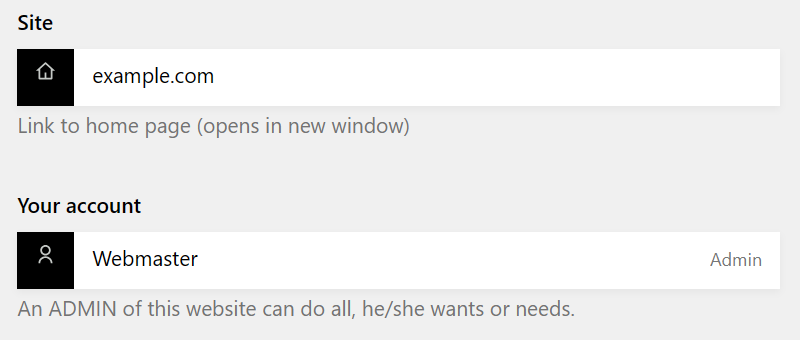

# Kirby Plugin: `twoPanelLinks`

Running **Kirby Version 2** we had two links ("Your site's URL" and "Your account") on the dashboard (start page) of the Panel.

The **plugin "`twoPanelLinks`"** offers these links for **Kirby Version >= 3** websites, where ever you need these links in the Panel:



> &nbsp;
> # We must create the VUE component before installing this plugin!!!
> 
> Look at https://getkirby.com/docs/guide/plugins/panel
> 
> Or **don't** set:  `'panel.vue.compiler' => false,` at your `site/config/config.php` !!!
> 
> &nbsp;


## Installation

### Download

[Download](https://github.com/HeinerEF/kirby-twopanellinks/archive/master.zip) the contents of this repository as ZIP file.

Rename the **extracted** folder to `heineref_twopanellinks` and copy it into the `site/plugins/` directory in your Kirby project. If it does not exist, create a new directory `site/plugins/` first.
This file `README.md` therefore receives the path `site/plugins/heineref_twopanellinks/README.md`.

### Composer

```
composer require HeinerEF/kirby-twopanellinks
```

### Git submodule

If you have used git in your project before:

```
git submodule add https://github.com/HeinerEF/kirby-twopanellinks.git site/plugins/heineref_twopanellinks
```


## Setup

### Blueprint

In the existing file "**site/blueprints/site.yml**" e.g. add these lines:

```YML
    sections:
      panelhomepage:
        type: panelhomepage
      paneluser:
        type: paneluser
```

May be you have to adapt these lines to your YML code of this file if you get errors in the Panel.

### Possible Result
The file **`site/blueprints/site.yml`** then *may* look like:

```YML
title: Website
### site/blueprints/site.yml
columns:
  # left
  - width: 1/2
    sections:
      # a list of **all** subpages of the first level
      thepages:
        type: pages
        headline:
          en: Pages
          de: Seiten
        create: # show all page types, but create only these:
          - default
          - another
        help:
          en: a list of **all** subpages of the first level
          de: eine Liste **aller** Unterseiten der ersten Ebene
      # a list of the **site** files
      thefiles:
        type: files
        headline:
          en: Global files
          de: Globale Dateien
        help:
          en: a list of the **site** files
          de: eine Liste der **Website**-Dateien
  # right
  - width: 1/2
    sections:
      panelhomepage:
        type: panelhomepage
      paneluser:
        type: paneluser
```

### Hints
- You can also use one of these links only!
- You can use this at every Panel page you want. The "**site.yml**" is only an example (to look like **Kirby 2**).
- You can change the **headline** text and/or the **help** text for both fields:

```YML
      panelhomepage:
        type: panelhomepage
        headline: Some text 1
        help: Another text 1
      paneluser:
        type: paneluser
        headline: Some text 2
        help: Another text 2
```

  or translate the texts:

```YML
      panelhomepage:
        type: panelhomepage
        headline:
          en: Some text 1
          de: Ein Text 1
        help:
          en: Another text 1
          de: Ein weiterer Text 1
      paneluser:
        type: paneluser
        headline:
          en: Some text 2
          de: Ein Text 2
        help:
          en: Another text 2
          de: Ein weiterer Text 2
```

## Requirements

This plugin was built using **Kirby 3.x** and tested up to **Kirby 5.x**.

It will not work on earlier versions.


## Disclaimer

This plugin is provided "**as is**" with no guarantee. Use it at your own risk and always test it yourself before using it in a production environment.


## License

[MIT](LICENSE.md)

It is not permitted to use this plugin in any project that promotes racism, sexism, homophobia, animal abuse, violence or any form of hate speech.


## Credits

- [Thomas Günther](https://forum.getkirby.com/t/kirby-3-panel-last-edited-pages/17259/3) for his link at Kirby 3 Panel - last edited pages #3 to his example (WIP) **History section for Kirby 3**
- [Oziris](https://forum.getkirby.com/t/kirby-3-panel-last-edited-pages/17259/15) for his contribution at Kirby 3 Panel - last edited pages #14

Thank you for your contributions!
